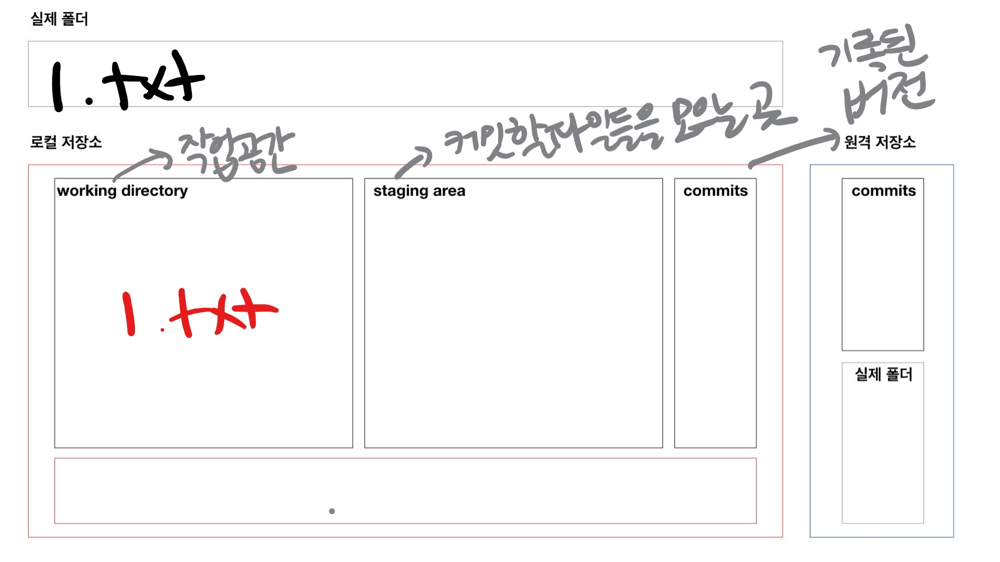

# Git 

> 분산 버전 관리시스템(DVCS)

## 준비 사항

* [git bash](https://gitforwindows.org/) (윈도우 사용하는 경우 필요)

## 기본 문법

### 0. git 저장소 생성

```bash
$ git init
# 비어있는 git 저장소(repository) 초기화했다..
# test 폴더에(절대경로) .git 폴더에..
Initialized empty Git repository in C:/Users/student/Desktop/test/.git/
(master) $
```

* 폴더에 git 저장소를 초기화하면, 
  * `.git` 폴더가 생성되고
  * bash에는 `(master)`라고 표기 된다.
* 주의사항!
  * git 저장소 내에 git 저장소를 만들지 말라.
    * `git init` 명령어 입력할 때, `(master)`가 보이면 절대! 입력하지 말 것

### 1. `add`

```bash
$ git add {디렉토리}
$ git add .  # 현재 디렉토리(하위 디렉토리 포함)
$ git add a.txt # 특정 파일
$ git add myfolder/ # 특정 폴더
```

* `working directory` 상태의 파일을 `staging area` 상태로 변경 (첫번째통 -> 두번째통)
* 커밋을 위한 파일들을 추가하는 명령어

#### 

#### 예시

```bash
$ touch a.txt    # 파일을 만든다 => 코드 작업을 했다
$ git status
On branch master

No commits yet
# Untracked files : 트래킹X 파일들
# git으로 관리된 적 없는 파일들.. 예) 파일 생성
Untracked files:
# git add 명령어를 사용해라
# 커밋이 될 곳에 포함시키위해서.. => Staging area..
  (use "git add <file>..." to include in what will be committed)
        a.txt #<-- 빨간색...
# 총평..
# nothing added to commit : 커밋할 것이 없음(SA X)
# untracked files present : WD O
nothing added to commit but untracked files present (use "git add" to track)
```

```bash
$ git status
On branch master

No commits yet
# 커밋될 변경사항들 : Staging area
Changes to be committed:
  (use "git rm --cached <file>..." to unstage)
  		# 새로운 파일!
        new file:   a.txt # <-- 초록색
```


### 2. `commit`

```bash
$ git commit -m '{커밋메시지}'
[master (root-commit) dc90372] Add a.txt
 1 file changed, 0 insertions(+), 0 deletions(-)
 create mode 100644 a.txt
```

* 커밋을 통해 하나의 버전으로 기록 된다.
* 커밋 메시지는 현재 변경사항들을 잘 나타낼 수 있도록 작성하자.
* 커밋은 고유한 아이디인 해시값을 가진다.
  * SHA-1 알고리즘에 의해 생성
* 커밋 목록은 `git log` 명령어를 통해 확인할 수 있다.

.jpg)

### 3. `log`

```bash
$ git log
commit dc903721f2a2f3cec37b3abb815470cc565b64c1 (HEAD -> master)
Author: tak <edutak.ssafy@gmail.com>
Date:   Thu Jun 3 15:34:01 2021 +0900

    Add a.txt

$ git log --oneline # 한줄로
dc90372 (HEAD -> master) Add a.txt

$ git log -2 # 2개
$ git log --oneline -1 # 1개를 한줄로
```

### 4. `status`

* working directory, staging area 공간의 파일 상태를 확인할 수 있다.

```bash
$ git status
On branch master
nothing to commit, working tree clean
```

_LI.jpg)


