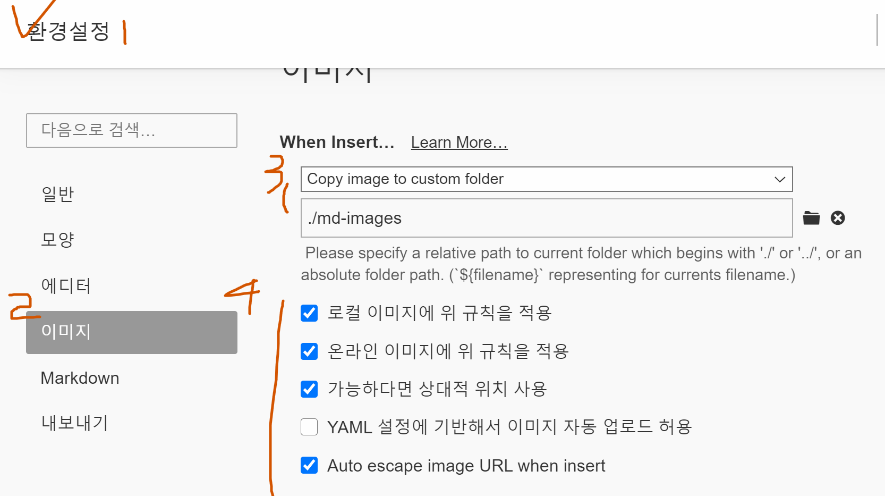

# 마크다운문법

## 제목(heading)

문서의 구조를 잡기 위해 활용된다. 제목의 레벨에 맞춰 `#`으로 표현한다.

### 제목3

#### 제목4

###### 제목5

###### 제목6

## 목록

* 순서가 없는 목록 ( `*` 누르고 입력 )
* 순서가 없습니다.
  * tab해서 들어가시고
  * 엔터해서 계속 쓰시다가
* shift+tab해서 나오시고
* 엔터+엔터하면 나가짐

이렇게

1. 순서가 있는 목록
2. 얘도 tab해보면
   1. 들어가지고
   2. 엔터해서 계속쓰다가
3.  shift+tab 해서 나오시고

## 코드 블록

인라인 코드 블록 `def` 

```python
# 주석
print('hello');
def foo():
    return True
```

여기 사이 글 쓰려면 </> 눌러서 엔터로 공간확보하면됨  ( ctrl+enter도 됨 )

```html
<!-- html(주석) -->
<h1>
    hello
</h1>

```

## 표

| 순번 | 이름   | 비고 |
| ---- | ------ | ---- |
| 1    | 홍길동 |      |
| 2    | 김철수 |      |
| 3    | 박영희 |      |

ctrl / 하셔서 표가 어떤 문법인지 봐주세요

## 이미지


* Typora 설정을 통해 이미지를 상대 경로로 복사하여 관리할 수 있도록 아래와 같이 설정한다.



## 링크

[구글 링크](https://google.com) 은 구글 (대괄호 소괄호)

[폴더](./md-images) 에 마크다운에 활용된 이미지가 있다 (ctrl 누르면서 클릭하면 이동함)

## 기타

*기울임(이탤릭체)*

**굵게(볼드체)**

~~취소선~~ <--- 물결 두개씩

---

